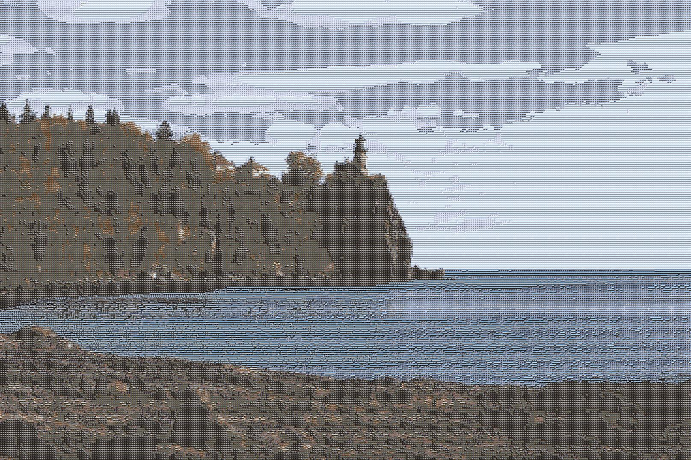

# UIUC STAT 107 - Data Science Discovery

This repository contains my work for STAT 107: Data Science Discovery at the University of Illinois Urbana-Champaign. Through this course, I learned about machine learning, statistical concepts, and data analysis using the pandas library.

## Highlighted Projects

### Project 1: Career Success Analysis (`/project2`)

In this project, I analyzed a dataset on education and career success to explore the factors that influence early-career outcomes, such as job offers and starting salaries. I applied Exploratory Data Analysis (EDA), data visualization, and a K-Nearest Neighbors (KNN) machine learning model to predict the number of job offers a student might receive.

### Project 2: Image Mosaic Generator (`/project_mosaic`)

This project is a Python program that transforms a standard image into a mosaic-style piece of art. The image below was generated by this project.

